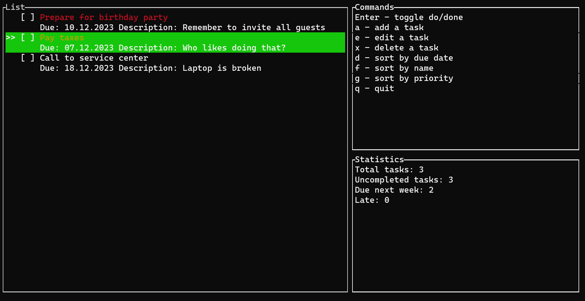

# Task Manager in Rust
## PL Homework 7
### Martins P, BITL4

Very simple task manager that fulfills basic CRUD functionality, stores data in SQLite and offers sorting and some statistics. Available operations are indicated at the right of the screen.

GUI was made using [Ratatui](https://github.com/ratatui-org/ratatui).

